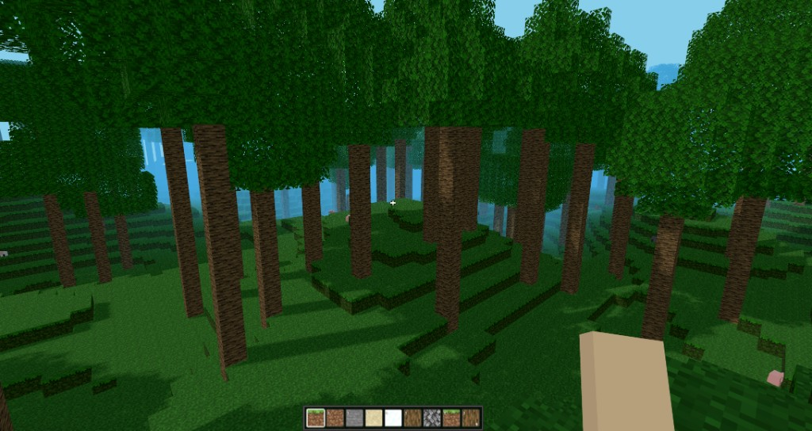

# Voxely

A browser-based voxel game – procedurally generated worlds, mine and place blocks, multiplayer, and third-person controls.

⚠️ **Alpha status:** This project is in an early alpha stage and may contain visible bugs and unfinished features.

## Gameplay mechanics (LLM-friendly)

- See `docs/GAMEPLAY_LLM.md` for a **current behavior vs target spec** breakdown designed for LLMs.




## Features

- **Procedural world** – Simplex noise terrain with multiple biomes:
  - Base: Plains, Ocean, Desert, Savanna, Forest, Jungle, Mountain, Snow
  - Highland variants: Meadow, Grove, Snowy Slopes, Stony Peaks, Frozen Peaks, Jagged Peaks, Cherry Grove, Windswept Hills, Windswept Gravelly Hills, Windswept Forest
- **Blocks** – Grass, dirt, stone, sand, snow, wood, leaves, torch, bedrock; mine (left-click) and place (right-click)
- **Water** – Global water level, surface rendering
- **Hotbar** – 9 slots (keys 1–9 / scroll wheel), block selection
- **Third-person** – Toggle camera (key **V**)
- **Multiplayer** – Multiple players in the same world (Socket.io), chat (key **T**)
- **Graphics options** – Render distance (2–12 chunks), shadows, antialiasing; settings persisted in localStorage

## Tech stack

| Area        | Technology           |
|------------|----------------------|
| Build      | Vite 7               |
| Frontend   | Vue 3, TypeScript    |
| 3D         | Three.js             |
| Styling    | Tailwind CSS 4       |
| Multiplayer| Socket.io (client)   |
| Terrain    | Simplex-noise, Web Worker (chunks) |

## Requirements

- **Node.js** 18+ (20+ recommended)
- **npm** (or pnpm/yarn)

## Installation

```bash
npm install
```

## Scripts

| Command             | Description                                |
|---------------------|--------------------------------------------|
| `npm run dev`       | Dev server (see terminal output for URL)   |
| `npm run build`     | TypeScript check + production build        |
| `npm run preview`   | Preview the build                          |
| `npm run textures`  | Texture generation script                  |
| `npm run server`    | Multiplayer server (http://localhost:3000) |
| `npm run test`      | Run tests in watch mode                    |
| `npm run test:run`  | Run tests once                             |

## Running the game

1. **Singleplayer only:**  
   Run `npm run dev` → open the shown URL in your browser (usually `http://localhost:5173`).

2. **With multiplayer:**  
   Start `npm run server` first, then in a second terminal run `npm run dev`. Open two browser tabs/windows with the same URL for two players in one world.  
   Details: [MULTIPLAYER.md](./MULTIPLAYER.md).

## Controls

| Action              | Key / Mouse                    |
|---------------------|--------------------------------|
| Start / focus mouse | Click once                      |
| Move                | **W A S D**                    |
| Jump                | **Space**                      |
| Look around         | Mouse                          |
| Third-person        | **V**                          |
| Chat                | **T**                          |
| Select block        | **1–9** or scroll wheel        |
| Pause / options     | **ESC** or **O**               |
| Inventory           | **I**                          |

After clicking: left-click = mine block, right-click = place block.

## Project structure (overview)

```
.
├── src/
│   ├── game.ts              # Core: terrain, chunks, rendering, physics, input
│   ├── terrain-core.ts      # Chunk generation, biomes, blocks (re-exports terrain/)
│   ├── chunk.worker.ts      # Web Worker: terrain + optional geometry (worker-geometry)
│   ├── chunk-runtime.ts     # Loaded chunk data, block modifications, world queries
│   ├── game-terrain.ts      # Height/surface helpers (uses chunk-runtime)
│   ├── game-collision.ts    # Voxel collision resolution
│   ├── save.ts              # Player + world persistence
│   ├── atmosphere.ts        # Day/night, sun direction
│   ├── terrain-fog.ts       # Terrain fog state and material patching
│   ├── multiplayer.ts       # Socket.io client, player sync
│   ├── graphics-settings.ts
│   ├── game-hotbar.ts       # Hotbar state and selection
│   ├── hotbar-icons.ts      # Hotbar UI assets
│   ├── resource-pack-settings.ts
│   ├── key-settings.ts
│   ├── game/
│   │   ├── init/            # materials.ts, scene.ts
│   │   ├── chunks/          # chunk-manager, chunk-planning, chunk-apply, chunk-worker-client, raycast-cache, visible-blocks
│   │   ├── player/          # player-mesh, pending-spawn
│   │   ├── render/          # frustum-visibility
│   │   └── world-interactions/  # mining, drops, torches
│   ├── terrain/             # Pure terrain pipeline, biomes, block-ids, worker-geometry
│   ├── entities/            # Spawn, movement, AI, animation
│   └── components/          # Vue: PauseMenu, Inventory, Chat, Menu
├── server/
│   └── server.js            # Multiplayer server (Socket.io)
├── public/assets/           # Minecraft-style assets (textures, models, etc.)
├── public/packs/             # Resource packs (see docs/RESOURCE_PACKS.md)
└── scripts/
    └── generate-textures.cjs
```

## World & performance

- **Chunk size:** 16×16 blocks
- **World height:** 128 blocks (Y 0–128)
- **Water level:** Y 64
- **Render distance:** Configurable (default 4 chunks), limits loaded chunks for stable FPS

The world is generated from a stored seed (localStorage) – same seed = same world after reload.

## License

Private project – no license specified.
