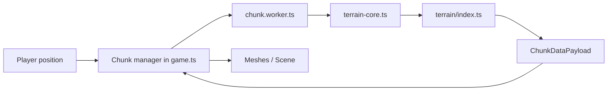

# Project Map – Where to Find Things

Single source of truth for navigating the Voxely codebase (Vue 3 + TypeScript + Three.js voxel game).

---

## Entry points

- **`index.html`** – Loads the app; points to `/src/main.ts`.
- **`src/main.ts`** – Boots Vue and mounts `App.vue`. Game logic is **not** here.
- **`src/App.vue`** – Root Vue component; wires up the game canvas and UI. The actual game loop, rendering, and chunk handling live in **`src/game.ts`**, which is initialized from the app.

---

## Game loop & chunks

- **`src/game.ts`** – Core: rendering (Three.js), input, physics, chunk load/unload, block mining/placement, hotbar, world API. Imports chunk payload type from `terrain-core` and builds meshes from payloads.
- **`src/chunk.worker.ts`** – Web Worker: generates chunk terrain data off the main thread. Receives `{ type: "init", seed }` then `{ type: "generate", chunkX, chunkZ, blockMods }`; sends back `ChunkDataPayload`. Uses **`terrain-core`** only (no direct `terrain/` import).
- **`src/terrain-core.ts`** – Thin re-export of `terrain/index.ts`: `createChunkGenerator`, `ChunkDataPayload`, `BlockModEntry`. This is the **contract boundary**: the worker and `game.ts` depend on `terrain-core`, not on `terrain/` directly.

**Data flow:**

---

## Terrain pipeline

All **pure** terrain logic (no THREE, no DOM) lives under **`src/terrain/`**:

| Path | Purpose |
|------|--------|
| **`terrain/index.ts`** | Pipeline orchestration: `createChunkGenerator(seed)` → `runPipeline`, exports `ChunkDataPayload`, `BlockModEntry`. |
| **`terrain/pipeline.ts`**, **`terrain/pipeline-types.ts`** | Pipeline stages runner and types. |
| **`terrain/stages/`** | Stage implementations: `heightmap-biome.ts`, `carve-3d.ts`, `stratigraphy.ts`, `structures.ts`. |
| **`terrain/biomes/`** | Biome registry (`index.ts`), per-biome files (e.g. `plains.ts`, `desert.ts`, `forest.ts`), `types.ts`, `registry.ts`. |
| **`terrain/features/trees.ts`** | Tree placement and shape. |
| **`terrain/block-ids.ts`** | Block type ↔ integer ID mapping (`typeToId`, `idToType`, `AIR_ID`, `CARVED_ID`, etc.). |
| **`terrain/utils.ts`** | Shared helpers (e.g. `makeSeededRandom`, `smoothstep`, `clamp`). |

When adding or changing biomes, use **`.cursor/skills/biome-integration-assistant`** and **`.cursor/rules/terrain-biome-integrity.mdc`**.

---

## Types & constants

- **`src/types.ts`** – Shared types: `BlockType`, `Biome`, `ChunkData`, `BlockPos`, `TreeNoiseCaches`, etc.
- **`src/constants.ts`** – `CHUNK_SIZE`, `WATER_LEVEL`, `WORLD_HEIGHT`, `SPAWN_*`, and other game constants.

---

## Block system

- **`src/block-registry.ts`** – Block definitions: IDs, names, texture names, solid/unbreakable flags. Used by game and materials.
- **`src/block-materials.ts`** – Three.js materials, texture loading, grass/foliage colormap sampling, shared geometries.
- **`src/terrain/block-ids.ts`** – Terrain-side block ID mapping (used inside the pipeline; aligns with `BlockType`).

---

## Entities

- **`src/entities/`** – Spawn, movement, AI, animation, meshes: `types.ts`, `registry.ts`, `spawn.ts`, `movement.ts`, `ai.ts`, `animation.ts`, `meshes.ts`. Spawn/despawn is driven from `game.ts` per chunk.

---

## UI (Vue)

- **`src/components/`** – Vue components: `PauseMenu.vue`, `Inventory.vue`, `Chat.vue`, `Menu.vue`. Wired from `App.vue` and game state.

---

## Assets

- **`public/assets/minecraft/`** – Minecraft-style layout: `textures/block/`, `textures/entity/`, optifine, models.
- **`public/packs/`** – Resource packs; selection and paths described in **`docs/RESOURCE_PACKS.md`**.
- **`public/textures/preview.html`** – Local texture preview page (dev aid).

---

## Server

- **`server/server.js`** – Multiplayer server (Socket.io); has its own **`server/package.json`** and `node_modules`.
- **`src/multiplayer.ts`** – Client: connection, player sync, chat.
- **`src/world-api.ts`** – World query API used by server/client for consistency.

See **`MULTIPLAYER.md`** at project root for running and usage.

---

## Tests

- **Vitest**; tests live next to code: **`src/**/*.test.ts`** (e.g. `terrain/pipeline.test.ts`, `terrain/utils.test.ts`, `terrain/biomes/registry.test.ts`).
- Run: **`npm run test:run`**. After biome or terrain contract changes, run tests and **`npm run build`**.

---

## Docs

- **`docs/README.md`** – Doc index and examples.
- **`docs/ARCHITECTURE.md`** – Architecture overview, improvement roadmap, algorithms (terrain, rendering, chunks, lighting, water, physics).
- **`docs/RESOURCE_PACKS.md`** – Resource pack compatibility and paths.
- **`docs/examples/`** – Reference implementations (e.g. greedy mesh, chunk worker).
