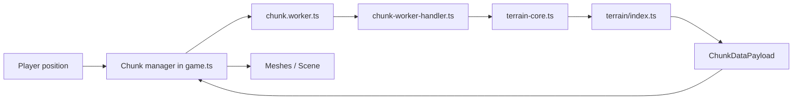

# Project Map – Where to Find Things

Single source of truth for navigating the Voxely codebase (Vue 3 + TypeScript + Three.js voxel game).

---

## Entry points

- **`index.html`** – Loads the app; points to `/src/main.ts`.
- **`src/main.ts`** – Boots Vue and mounts `App.vue`. Game logic is **not** here.
- **`src/App.vue`** – Root Vue component; wires up the game canvas and UI. The actual game loop, rendering, and chunk handling live in **`src/game.ts`**, which is initialized from the app.

---

## Game loop & chunks

- **`src/game.ts`** – Orchestration: init order, render loop (`animate`), input/controls, per-frame updates (movement, camera, block break/place, atmosphere, shadows). Delegates heavy lifting to extracted modules below.
- **`src/chunk.worker.ts`** – Web Worker entry: delegates to `chunk-worker-handler.ts`.
- **`src/chunk-worker-handler.ts`** – Pure, testable handler for worker messages (init/generate state machine). Encapsulated so it runs in both the real Web Worker and Node/Vitest tests.
- **`src/chunk-runtime.ts`** – Runtime chunk state on the main thread: loaded `ChunkData` map, block modifications map, column height cache, key helpers (`chunkKey`, `blockKeyNumeric`), and block lookup (`getBlockAt`, `isSolidBlock`).
- **`src/terrain-core.ts`** – Thin re-export of `terrain/index.ts`: `createChunkGenerator`, `ChunkDataPayload`, `BlockModEntry`. This is the **contract boundary**: the worker and `game.ts` depend on `terrain-core`, not on `terrain/` directly.

**Chunk pipeline (main thread):** **`src/game/chunks/chunk-manager.ts`** – coordinates load/unload; **`src/game/chunks/chunk-planning.ts`** – `planChunksAroundPlayer` (toLoad / toUnload); **`src/game/chunks/chunk-apply.ts`** – turns payloads into meshes and registers chunk data; **`src/game/chunks/chunk-worker-client.ts`** – starts worker and sends requests; **`src/game/chunks/chunk-generate-sync.ts`** – synchronous chunk generation fallback (instanced mesh building, water geometry, block break/unload, visibility filtering). **`src/game/chunks/raycast-cache.ts`** and **`src/game/chunks/visible-blocks.ts`** – visibility and raycast/mining data.

**Data flow:**

The payload may include `geometryLayers` and `visibleBlockKeysByType` produced in the worker.

---

## Terrain pipeline

All **pure** terrain logic (no THREE, no DOM) lives under **`src/terrain/`**:

| Path                                                       | Purpose                                                                                                              |
| ---------------------------------------------------------- | -------------------------------------------------------------------------------------------------------------------- |
| **`terrain/index.ts`**                                     | Pipeline orchestration: `createChunkGenerator(seed)` → `runPipeline`, exports `ChunkDataPayload`, `BlockModEntry`.   |
| **`terrain/pipeline.ts`**, **`terrain/pipeline-types.ts`** | Pipeline stages runner and types.                                                                                    |
| **`terrain/stages/`**                                      | Stage implementations (see table below).                                                                             |
| **`terrain/biomes/`**                                      | Biome registry and per-biome files (see Biomes section below).                                                       |
| **`terrain/features/`**                                    | Feature placement: trees, flowers, ferns, ore, ground cover, etc. (see table below).                                 |
| **`terrain/structures/`**                                  | Structure origin placement and templates (see table below).                                                          |
| **`terrain/block-ids.ts`**                                 | Block type ↔ integer ID mapping (`typeToId`, `idToType`, `AIR_ID`, `CARVED_ID`, etc.).                               |
| **`terrain/utils.ts`**                                     | Shared helpers (e.g. `makeSeededRandom`, `smoothstep`, `clamp`).                                                     |
| **`terrain/worker-geometry.ts`**                           | Worker-only: builds geometry layers and visible-block keys from the voxel buffer; used by `chunk-worker-handler.ts`. |

### Terrain stages

| File                          | Purpose                                                          |
| ----------------------------- | ---------------------------------------------------------------- |
| `stages/heightmap-biome.ts`   | Stage 1: heightmap generation and biome assignment.              |
| `stages/carve-3d.ts`          | Stage 2: 3D noise carving (base caves).                          |
| `stages/carve-cheese.ts`      | Cheese cave carving (large open caverns).                        |
| `stages/carve-spaghetti.ts`   | Spaghetti cave carving (narrow winding tunnels).                 |
| `stages/stratigraphy.ts`      | Stage 3: layer assignment (dirt, sand, stone, etc.).             |
| `stages/structures.ts`        | Stage 4: legacy structure placement.                             |
| `stages/stage5-structures.ts` | Stage 5: template-based structure placement (villages, temples). |

### Terrain features

| File                           | Purpose                                                              |
| ------------------------------ | -------------------------------------------------------------------- |
| `features/trees.ts`            | Tree placement and shape (oak, birch, jungle, spruce, cherry, etc.). |
| `features/flowers.ts`          | Flower placement (poppies, dandelions, tulips, etc.).                |
| `features/ferns.ts`            | Fern and tall grass placement.                                       |
| `features/ground.ts`           | Ground cover (pebbles, fallen leaves, etc.).                         |
| `features/ore.ts`              | Ore vein placement (coal, iron, gold, diamond, etc.).                |
| `features/desert-decor.ts`     | Desert-specific decorations (dead bushes, cacti).                    |
| `features/shore-vegetation.ts` | Shore/coastal vegetation (reeds, lilypads).                          |

### Terrain structures

| File                              | Purpose                                                                                                                             |
| --------------------------------- | ----------------------------------------------------------------------------------------------------------------------------------- |
| `structures/origins.ts`           | Deterministic structure origin placement: grid-based candidates, biome/flatness checks. Exports `StructureType`, `StructureOrigin`. |
| `structures/templates/temple.ts`  | Desert temple template.                                                                                                             |
| `structures/templates/village.ts` | Village template (houses, paths, wells).                                                                                            |

### Biomes

Registry: **`terrain/biomes/index.ts`** (exports `BIOME_TERRAIN`, `BIOME_LAYERS`, `BIOME_REGISTRY`), types in **`terrain/biomes/types.ts`**, runtime registry in **`terrain/biomes/registry.ts`**.

Per-biome files in `terrain/biomes/`:

| File                          | Biome                    |
| ----------------------------- | ------------------------ |
| `plains.ts`                   | Plains                   |
| `desert.ts`                   | Desert                   |
| `forest.ts`                   | Forest                   |
| `jungle.ts`                   | Jungle                   |
| `ocean.ts`                    | Ocean                    |
| `snow.ts`                     | Snow                     |
| `savanna.ts`                  | Savanna                  |
| `meadow.ts`                   | Meadow                   |
| `mountain.ts`                 | Mountain                 |
| `grove.ts`                    | Grove                    |
| `cherry_grove.ts`             | Cherry grove             |
| `snowy_slopes.ts`             | Snowy slopes             |
| `frozen_peaks.ts`             | Frozen peaks             |
| `jagged_peaks.ts`             | Jagged peaks             |
| `stony_peaks.ts`              | Stony peaks              |
| `windswept_hills.ts`          | Windswept hills          |
| `windswept_forest.ts`         | Windswept forest         |
| `windswept_gravelly_hills.ts` | Windswept gravelly hills |

When adding or changing biomes, use **`.cursor/skills/biome-integration-assistant`** and **`.cursor/rules/terrain-biome-integrity.mdc`**.

---

## Game subsystems (root-level modules)

These modules are extracted from `game.ts` for testability and separation of concerns:

| File                          | Purpose                                                                                                             |
| ----------------------------- | ------------------------------------------------------------------------------------------------------------------- |
| **`src/atmosphere.ts`**       | Day/night cycle, sky color, fog, sun/moon positioning, underwater tint. Called per-frame from `game.ts`.            |
| **`src/game-collision.ts`**   | Voxel AABB collision resolution. Exports `resolveVoxelCollisions`, player AABB constants.                           |
| **`src/game-terrain.ts`**     | Main-thread terrain sampling, biome lookup, spawn search, tree generation. Uses `chunk-runtime` for height cache.   |
| **`src/game-hotbar.ts`**      | Hotbar (9-slot block selection), inventory add, slot cycling.                                                       |
| **`src/save.ts`**             | Save/load serialization to localStorage (`SaveData`, `SAVE_VERSION`).                                               |
| **`src/terrain-sampling.ts`** | Pure terrain sampling for the main thread: biome, height, surface block type. Same formulas as `terrain/` pipeline. |
| **`src/hotbar-icons.ts`**     | Block type → icon texture URL and display name for the hotbar UI.                                                   |

---

## Settings

| File                                | Purpose                                                                                                                               |
| ----------------------------------- | ------------------------------------------------------------------------------------------------------------------------------------- |
| **`src/graphics-settings.ts`**      | Render distance, shadows, antialias, FOV, clouds, water quality. Persisted in localStorage; read by `game.ts`, written by options UI. |
| **`src/key-settings.ts`**           | Keybinding configuration.                                                                                                             |
| **`src/resource-pack-settings.ts`** | Resource pack selection and paths.                                                                                                    |

---

## Fog & materials

- **`src/terrain-fog.ts`** – Terrain fog state and `patchMaterialWithTerrainFog`. Used by **`src/game/init/materials.ts`** and **`src/game/chunks/chunk-apply.ts`**.

---

## Player, render, world interactions

- **`src/game/player/`** – `player-mesh.ts`, `pending-spawn.ts`.
- **`src/game/render/`** – `frustum-visibility.ts`.
- **`src/game/world-interactions/`** – `mining.ts`, `drops.ts`, `torches.ts`.

---

## Init helpers, debug, shared context

- **`src/game/init/scene.ts`** – Creates scene, camera, renderer, torch container. Called from `game.ts` during init.
- **`src/game/init/materials.ts`** – Block materials, texture loading, grass/foliage colormaps.
- **`src/game/init/lights-sky.ts`** – Creates sun, moon, sky shader, clouds, stars.
- **`src/game/debug/terrain-debug.ts`** – Terrain debug overlay, block debug logging, surface decision reasons.
- **`src/game/game-context.ts`** – `GameContext` type: shared mutable state for per-frame update functions (movement, camera, block interactions).

---

## Types & constants

- **`src/types.ts`** – Shared types: `BlockType`, `Biome`, `ChunkData`, `BlockPos`, `TreeNoiseCaches`, etc.
- **`src/constants.ts`** – `CHUNK_SIZE`, `WATER_LEVEL`, `WORLD_HEIGHT`, `SPAWN_*`, and other game constants.

---

## Block system

- **`src/block-registry.ts`** – Block definitions: IDs, names, texture names, solid/unbreakable flags. Used by game and materials.
- **`src/block-materials.ts`** – Three.js materials, texture loading, grass/foliage colormap sampling, shared geometries.
- **`src/terrain/block-ids.ts`** – Terrain-side block ID mapping (used inside the pipeline; aligns with `BlockType`).

---

## Entities

- **`src/entities/`** – Spawn, movement, AI, animation, meshes: `types.ts`, `registry.ts`, `spawn.ts`, `movement.ts`, `ai.ts`, `animation.ts`, `meshes.ts`. Spawn/despawn is driven from `game.ts` per chunk.

---

## UI (Vue)

- **`src/components/`** – Vue components: `PauseMenu.vue`, `Inventory.vue`, `Chat.vue`, `Menu.vue`. Wired from `App.vue` and game state.

---

## Assets

- **`public/assets/minecraft/`** – Minecraft-style layout: `textures/block/`, `textures/entity/`, optifine, models.
- **`public/packs/`** – Resource packs; selection and paths described in **`docs/RESOURCE_PACKS.md`**.
- **`public/textures/preview.html`** – Local texture preview page (dev aid).

---

## Server

- **`server/server.js`** – Multiplayer server (Socket.io); has its own **`server/package.json`** and `node_modules`.
- **`src/multiplayer.ts`** – Client: connection, player sync, chat.
- **`src/world-api.ts`** – World query API used by server/client for consistency.

See **`MULTIPLAYER.md`** at project root for running and usage.

---

## Tests

- **Vitest** (configured in `vite.config.ts`); tests live next to code as **`*.test.ts`**.
- Run: **`npm run test:run`**. After biome or terrain contract changes, run tests and **`npm run build`**.

Key test files:

| Test file                                     | What it covers                         |
| --------------------------------------------- | -------------------------------------- |
| `src/terrain/pipeline.test.ts`                | Terrain pipeline end-to-end            |
| `src/terrain/utils.test.ts`                   | Terrain utility functions              |
| `src/terrain/biomes/registry.test.ts`         | Biome registry completeness            |
| `src/terrain/block-ids.test.ts`               | Block ID mapping roundtrip             |
| `src/chunk-worker-handler.test.ts`            | Worker message handler (init/generate) |
| `src/chunk-runtime.test.ts`                   | Chunk runtime state and block lookup   |
| `src/chunk-payload-contract.test.ts`          | Chunk payload shape contract           |
| `src/game-collision.test.ts`                  | Collision resolution                   |
| `src/save.test.ts`                            | Save/load serialization                |
| `src/block-registry.test.ts`                  | Block registry definitions             |
| `src/game/chunks/chunk-manager.test.ts`       | Chunk load/unload coordination         |
| `src/game/chunks/chunk-apply.test.ts`         | Payload → mesh application             |
| `src/game/chunks/chunk-worker-client.test.ts` | Worker client communication            |
| `src/game/chunks/raycast-cache.test.ts`       | Raycast cache                          |

---

## Infrastructure

- **`scripts/`** – Build/dev scripts (e.g. `generate-textures.cjs`).
- **`.github/workflows/test.yml`** – CI: runs tests on push/PR.
- **`vite.config.ts`** – Vite config + Vitest integration.
- **`tsconfig.json`** – TypeScript configuration.

---

## Docs

- **`docs/README.md`** – Doc index and examples.
- **`docs/ARCHITECTURE.md`** – Architecture overview, improvement roadmap, algorithms (terrain, rendering, chunks, lighting, water, physics).
- **`docs/BLOCK_SYSTEM.md`** – LLM-first block representation, queries, rendering (CURRENT vs TARGET).
- **`docs/TERRAIN_SPEC.md`** – LLM-first terrain/biome spec: design intent, Minecraft-adapted mechanics, change safety checklists.
- **`docs/BIOME_TRANSITIONS.md`** – Minecraft-style biome boundaries and transitions (climate space, density, surface rules, blending).
- **`docs/DESERT_BIOME_TECHNICAL.md`** – Technical breakdown of desert biome (selection, surface, features, structures).
 - **`docs/PLAINS_BIOME.md`** – Technical breakdown of plains biome (climate selection, shape, surface, features, structures, spawns); canonical example for biome design.
- **`docs/GAMEPLAY_LLM.md`** – Gameplay reference for LLMs (mechanics, controls, world rules).
- **`docs/RESOURCE_PACKS.md`** – Resource pack compatibility and paths.
- **`docs/LLM_WORKFLOW.md`** – LLM workflow and usage notes.
- **`docs/examples/`** – Reference implementations (e.g. greedy mesh, chunk worker).
