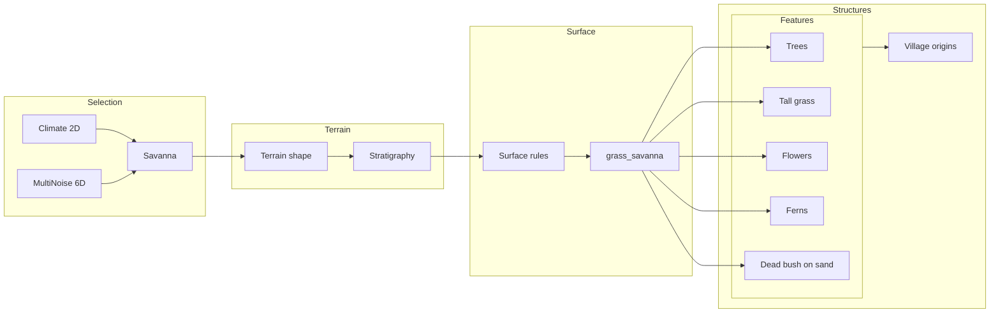

# Savanna Biome — Technical Documentation

This document describes what the **Savanna** biome is, which animals can appear, its special characteristics, and how it is technically built in Voxely. It is written for **LLMs and engine developers** and serves as the authoritative reference when changing savanna terrain, features, or biome selection.

Design intent is inspired by [Minecraft’s Savanna biome](https://minecraft.fandom.com/wiki/Savanna); implementation details refer to the current Voxely codebase.

Related docs:

- [BIOMES.md](BIOMES.md) — list of all biomes, climate bounds, spawn behaviour
- [BIOME_TRANSITIONS.md](BIOME_TRANSITIONS.md) — how biome boundaries and transitions work
- [PROJECT_MAP.md](PROJECT_MAP.md) — where biome code lives (`terrain/biomes/`)
- [TERRAIN_SPEC.md](TERRAIN_SPEC.md) — pipeline and design targets
- [SURFACE_GENERATION.md](SURFACE_GENERATION.md) — surface rules and block variants
- [PLAINS_BIOME.md](PLAINS_BIOME.md), [FOREST_BIOME_TECHNICAL.md](FOREST_BIOME_TECHNICAL.md), [DESERT_BIOME_TECHNICAL.md](DESERT_BIOME_TECHNICAL.md) — other per-biome technical docs

---

## 1. What is the Savanna biome?

**Savanna** is a **warm, semi-arid grassland** that sits between desert and forest/jungle in climate space. It is characterized by:

- **Terrain:** Flat or gently rolling; sparse trees, open sightlines.
- **Surface:** Dry-looking grass (a distinct block variant, `grass_savanna`), with a warmer, browner tint than normal grass.
- **Vegetation:** Tall grass, drought-tolerant flowers (dandelion, poppy, red tulip), ferns, and **dead bushes on sand** (shared with desert). Trees are sparse and use the same placement logic as plains (high threshold, so few trees per chunk).
- **Structures:** Villages can generate in savanna (same structure-origin logic as plains, meadow, forest, cherry_grove).

### 1.1 Minecraft reference

In Minecraft, Savanna and Savanna Plateau feature **acacia trees**, tall grass, and very scattered trees. Typical mobs include **horses**, **donkeys**, and **llamas**. Villages can generate. In Voxely there is currently **no** dedicated acacia tree model; savanna uses the same tree shapes as plains (sparse placement, threshold 0.93). Future work could add savanna-specific trees or mobs (e.g. horses).

---

## 2. Which animals can appear?

Entity spawn is defined in [src/entities/spawn.ts](src/entities/spawn.ts) via `ANIMAL_DEFS`. Each animal has a `spawnBiomes` list:

| Animal | Spawn biomes (current) |
|--------|------------------------|
| Sheep  | plains, forest, jungle, meadow, **savanna** |
| Pig    | plains, forest, jungle, meadow, **savanna** |
| Wolf   | forest, jungle, mountain, snow, grove |

**Sheep and pig** can spawn in savanna (same as other grassland biomes). **Wolf** does not spawn in savanna. In Minecraft, savanna is also associated with horses, donkeys, and llamas; adding a future horse or similar mob with savanna in its spawn list would align with that.

---

## 3. Special things about Savanna

### 3.1 Surface block: grass_savanna

Savanna uses a dedicated grass block variant **`grass_savanna`** (warm/dry tint), not the default `grass`. The rule is in [src/terrain/surface-rules.ts](src/terrain/surface-rules.ts): when the biome is savanna and the effective surface is grass, the block becomes `grass_savanna`. The block is registered in [src/block-registry.ts](src/block-registry.ts) and [src/terrain/block-ids.ts](src/terrain/block-ids.ts).

### 3.2 Vegetation

- **Tall grass:** Placed in savanna with threshold band 0.3–0.75 ([src/terrain/features/ground.ts](src/terrain/features/ground.ts)).
- **Flowers:** Dandelion, poppy, red tulip in defined noise bands ([src/terrain/features/flowers.ts](src/terrain/features/flowers.ts)); flowers use `grass_savanna` as an allowed surface.
- **Ferns:** Savanna is included in the fern feature ([src/terrain/features/ferns.ts](src/terrain/features/ferns.ts)); ferns can appear on grass_savanna/dirt.
- **Dead bush on sand:** The desert-decor feature places dead bushes on sand in **both** desert and savanna ([src/terrain/features/desert-decor.ts](src/terrain/features/desert-decor.ts)). Cactus is desert-only.

### 3.3 Structures

Savanna is **village-eligible**. In [src/terrain/structures/origins.ts](src/terrain/structures/origins.ts), `villageBiome()` returns true for plains, meadow, forest, **savanna**, and cherry_grove. Village origins are placed only where the biome is one of these and terrain flatness checks pass.

### 3.4 Player spawn

Savanna is one of the **eight spawn biomes**. The game picks a single spawn biome per world seed from `SPAWNABLE_BIOMES` in [src/game-terrain.ts](src/game-terrain.ts); the list includes desert, badlands, plains, **savanna**, forest, jungle, mountain, and snow. So the player can start in savanna.

### 3.5 No grass_snow at altitude

Savanna is in `BIOMES_WITHOUT_GRASS_SNOW` ([src/terrain/tree-constants.ts](src/terrain/tree-constants.ts)). Even at high elevation, savanna surface stays `grass_savanna` and is **never** replaced by `grass_snow` (unlike plains/forest in cold or high areas).

### 3.6 Grass colormap

Savanna has an entry in the grass colormap in [src/block-materials.ts](src/block-materials.ts) (`savanna: { temp: 0.9, humidity: 0.2 }`), giving the warm, dry tint used for grass shading in this biome.

---

## 4. How it is technically built

### 4.1 Pipeline overview

Savanna is a **base land biome**. It is chosen by the same multi-stage pipeline as other land biomes:

### 4.2 Biome selection

**File:** [src/terrain/biomes/savanna.ts](src/terrain/biomes/savanna.ts)

- **Climate (2D):** Used for nearest-match selection in temperature/humidity space.
  - `tempMin: 0.55`, `tempMax: 0.75` — warm.
  - `humidityMin: 0.35`, `humidityMax: 0.55` — semi-arid, moderate humidity.
- **Multi-noise (6D):** Center and weights used when selection uses 6D multi-noise:
  - Center: `continentalness: 0.68`, `erosion: 0.12`, `temperature: 0.3`, `humidity: -0.1`, `weirdness: 0.05`, `y: 0.25`.
  - Weights: `temperature: 2`, `humidity: 2`, `continentalness: 1.3`, `erosion: 1.1`.

So savanna is chosen in **warm, moderately dry** inland regions. Neighbours in climate space tend to be plains, desert, forest, or jungle depending on temperature and humidity.

### 4.3 Terrain shape

**Terrain params** in the same file (`savannaTerrain`):

| Parameter          | Value   | Meaning |
|--------------------|---------|---------|
| `baseOffset`       | -0.3    | Slightly lower base height. |
| `detailAmp`        | 1.1     | Small amplitude for detail noise. |
| `detailFreq`       | 0.012   | Detail noise frequency. |
| `flatness`         | 0.98    | Very flat terrain. |
| `mountainAllowed`  | false   | No mountain blending. |

Result: savanna is **very flat** with minimal relief, similar in spirit to plains but with its own climate band.

### 4.4 Surface and layers

**Block set** (`savannaDefinition.blocks` and `savannaLayers`):

| Layer / role    | Block          |
|-----------------|----------------|
| Surface         | `grass_savanna`|
| Subsurface      | `dirt`         |
| Subsurface depth| 2              |
| Shore           | `sand`         |
| Underwater      | `sand`         |

The stratigraphy pass uses this definition. The **surface rules** in [src/terrain/surface-rules.ts](src/terrain/surface-rules.ts) then ensure that when the biome is savanna and the effective surface would be grass, the final block is `grass_savanna`.

### 4.5 Features (where they are applied)

| Feature      | File / location | Savanna behaviour |
|-------------|------------------|--------------------|
| Trees       | [src/terrain/index.ts](src/terrain/index.ts) | Same as plains/meadow/cherry_grove: `placement > TREE_PLACEMENT_PLAINS_THRESHOLD` (0.93), no forest density; trees only on grass_savanna/dirt/grass/grass_snow. |
| Tall grass  | [src/terrain/features/ground.ts](src/terrain/features/ground.ts) | Band 0.3–0.75. |
| Flowers     | [src/terrain/features/flowers.ts](src/terrain/features/flowers.ts) | Dandelion, poppy, tulip_red in defined thresholds. |
| Ferns       | [src/terrain/features/ferns.ts](src/terrain/features/ferns.ts) | Savanna allowed; default fern threshold. |
| Dead bush   | [src/terrain/features/desert-decor.ts](src/terrain/features/desert-decor.ts) | Placed on sand in desert and savanna; cactus only in desert. |

Shore vegetation in [src/terrain/features/shore-vegetation.ts](src/terrain/features/shore-vegetation.ts) treats `grass_savanna` as a valid grass surface where applicable.

### 4.6 Registry and types

- **Biome definition and terrain:** [src/terrain/biomes/savanna.ts](src/terrain/biomes/savanna.ts) exports `savannaDefinition`, `savannaTerrain`, `savannaLayers`.
- **Registry:** [src/terrain/biomes/registry.ts](src/terrain/biomes/registry.ts) imports and registers savanna; [src/terrain/biomes/index.ts](src/terrain/biomes/index.ts) exposes savanna in `BIOME_LAYERS` and gives it `BIOME_VALUE` 2 for macro terrain sampling.
- **Biome type:** The `Biome` union in [src/types.ts](src/types.ts) includes `'savanna'`.

For checklist and tests when changing biomes, see the terrain-biome-integrity rule and [src/terrain/biomes/registry.test.ts](src/terrain/biomes/registry.test.ts).

---

## 5. Summary

- **What:** Warm, semi-arid grassland with `grass_savanna`, sparse trees, tall grass, flowers, ferns, and dead bushes on sand.
- **Animals:** Sheep and pig spawn in savanna; wolf does not. Minecraft also has horses, donkeys, llamas — extend `ANIMAL_DEFS` if adding those.
- **Special:** grass_savanna only in savanna; village-eligible; spawn biome; no grass_snow at altitude; warm/dry grass colormap.
- **Technical:** Base land biome selected by climate (temp 0.55–0.75, humidity 0.35–0.55) and multi-noise; very flat terrain (flatness 0.98); surface and features wired through the standard pipeline and the files referenced above.
