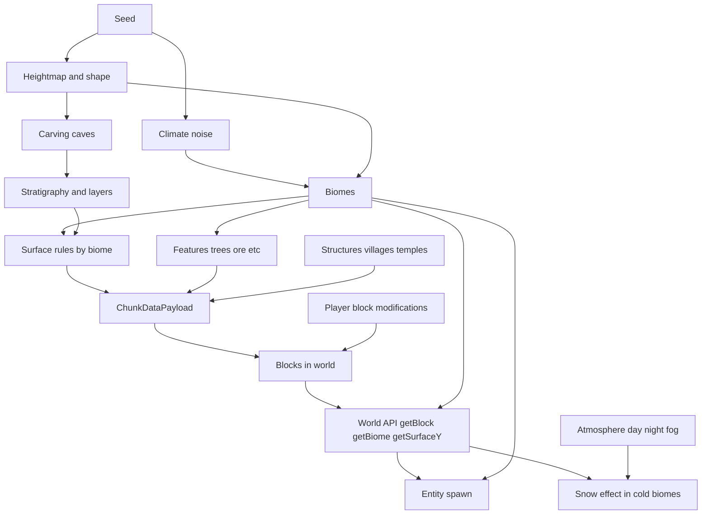

# Systems Overview – How Everything Fits Together

This document is the **meta overview** for Voxely: how world generation, biomes, biome transitions, blocks, entities (mobs), and atmosphere/weather connect. For “where to find code” use [PROJECT_MAP.md](./PROJECT_MAP.md); for runtime architecture use [ARCHITECTURE.md](./ARCHITECTURE.md).

---

## Summary

- **Seed** drives all deterministic world generation (terrain, biomes, features, structures).
- **Climate** (temperature, humidity, continentalness, erosion, etc.) is sampled from noise and selects **biomes** per column; height can refine the biome (e.g. snowy_slopes on mountains).
- **Biomes** drive terrain shape (height, layers), **surface blocks** (grass, sand, snow), **features** (trees, flowers, ore), and **entity spawn** (each animal kind has a list of allowed biomes).
- **Blocks** come from the terrain pipeline (stratigraphy + surface rules by biome) plus **player edits** stored as overrides in the chunk runtime.
- **Entities (mobs)** spawn when a chunk is loaded; spawn positions use the world API’s `getBiome(x,z)` so only biomes in that kind’s `spawnBiomes` get animals.
- **Atmosphere** is day/night (sun/moon, sky, fog). **“Weather”** is currently only a **snow effect**: falling particles in cold biomes (snow, grove, snowy_slopes, frozen_peaks, jagged_peaks). There is no generic rain or global weather system.

---

## How the systems connect

---

## World generation flow

World generation is a **12-stage pipeline** (Minecraft-aligned, pure logic in `src/terrain/`, no THREE/DOM):

1. **empty** – Initial chunk state (no-op).
2. **structures_starts** – Compute structure origins for this chunk; store in context.
3. **structures_references** – Refs to neighboring structure chunks (no-op, reserved).
4. **noise** – Terrain shape: fill heightmap from height sampling.
5. **biomes** – Biome per column from heightmap and climate (and POI overrides).
6. **carvers** – Caves: 3D noise, cheese, spaghetti carving.
7. **surface** – Stratigraphy: layers (stone, dirt, etc.) and surface material; water below water level.
8. **features** – Trees, flowers, ore, ground cover, desert decor, shore vegetation; then paint template structures (villages, temples) from context.
9. **initialize_light** – Prepare lighting (no-op).
10. **light** – Compute light (no-op).
11. **spawn** – Spawn mobs (no-op; spawn stays on main thread).
12. **full** – Generation complete (no-op).

The pipeline produces a **ChunkDataPayload** (voxel buffer, heightmap, optional geometry). The main thread applies payloads into meshes and stores chunk data for block lookups. Player block changes are **overrides** on top of generated terrain.

See [TERRAIN_SPEC.md](./TERRAIN_SPEC.md) for pipeline details and invariants; [ARCHITECTURE.md](./ARCHITECTURE.md) for worker contract and chunk apply.

---

## Biomes and transitions

Biomes are chosen from **climate parameters** (temperature, humidity, continentalness, erosion, weirdness) sampled deterministically from seed and coordinates. Selection is a nearest-match in “climate space”, so boundaries appear where a different biome becomes the best match even though the underlying noise is smooth. Height can further refine the biome (e.g. high elevation in a mountain base → snowy_slopes or peaks). Surface block type (grass/sand/snow) and colors use the resolved biome, with dithered transitions near boundaries to avoid hard lines. For how Minecraft balances biome distribution—climate clustering, weighted rarity, fallback, and sub-biomes—see [TERRAIN_SPEC.md §5.7](./TERRAIN_SPEC.md#57-biome-balance-and-distribution).

The **Plains** biome is our canonical example for this system: temperate, moderately humid, smooth inland terrain; gentle height profile; grass‑over‑dirt surface; sparse oaks; plains villages; and strong association with farm animals and horses. Use it as the main reference when designing or tuning similar biomes.

See [BIOME_TRANSITIONS.md](./BIOME_TRANSITIONS.md) for the Minecraft-style explanation; [TERRAIN_SPEC.md](./TERRAIN_SPEC.md) for the biome data model and pipeline; [DESERT_BIOME_TECHNICAL.md](./DESERT_BIOME_TECHNICAL.md) for one biome as a worked example; and [PLAINS_BIOME.md](./PLAINS_BIOME.md) for a full plains biome breakdown.

---

## Blocks

Blocks are defined by the **terrain pipeline** (block IDs in the voxel buffer and heightmap) and by **block modifications** (player place/break) stored in the chunk runtime. The **block registry** maps block types to names, textures, and flags (solid, unbreakable). Surface blocks (grass, sand, snow) come from the biome’s layer config. Grass and foliage use colormap-based tinting for biome colors. At runtime, `getBlockAt` returns the overlay if present, otherwise the generated block; unloaded chunks return null.

For a breakdown of block type categories—solid, plant, crop, fluid—see [BLOCK_TYPES.md](./BLOCK_TYPES.md). See [BLOCK_SYSTEM.md](./BLOCK_SYSTEM.md) for how blocks are represented and rendered; [PROJECT_MAP.md](./PROJECT_MAP.md) for chunk runtime and block registry locations.

---

## Entities (mobs)

Entities spawn when a **chunk is loaded**. Natural (non-zone, non-village) animal spawn uses **Minecraft-style** rules: one **representative biome per chunk** (chunk center), a **per-biome creature spawn probability** (e.g. 0.1 for most land, 0 for ocean, 0.07 for snowy biomes), and a **weighted creature pick** so each iteration chooses which animal and group size to spawn. Only positions whose biome is in that kind’s **`spawnBiomes`** and whose surface block is valid (grass, grass_snow, grass_savanna, sand) get an entity. Spawn height is **`getColumnSurfaceY(x,z)`**. Zone spawns (e.g. sheep ring) and village/fixed POI spawns are unchanged and take precedence per (chunk, kind). Despawn happens when the chunk is unloaded.

Hostile mobs and spawn rules (e.g. light level) are not implemented yet; they are design targets in [GAMEPLAY_LLM.md](./GAMEPLAY_LLM.md). Code: [src/entities/spawn.ts](../src/entities/spawn.ts) (`ANIMAL_DEFS`, `spawnEntitiesForChunk`), [src/entities/spawn-constants.ts](../src/entities/spawn-constants.ts) (per-biome probability, surface blocks).

---

## Atmosphere and “weather”

- **Atmosphere** (`src/atmosphere.ts`): Day/night cycle, sun and moon position, sky color, fog. Updated per frame from the main loop; affects lighting and terrain fog.
- **Weather**: There is no generic weather system (no rain, no global “storm” state). The only weather-like effect is **snow**: falling particles visible only in **cold biomes** (snow, grove, snowy_slopes, frozen_peaks, jagged_peaks) and when above the water surface. The snow effect uses the world API’s biome at the player position. See [src/snow-effect.ts](../src/snow-effect.ts) (`COLD_BIOMES`, `SnowEffectContext`).

---

## Where to read more

| Topic | Document |
|-------|----------|
| How world gen, biomes, blocks, mobs, weather connect | This doc (SYSTEMS_OVERVIEW.md) |
| Where to find code (entry points, terrain, entities, UI) | [PROJECT_MAP.md](./PROJECT_MAP.md) |
| Runtime architecture (main loop, chunks, worker, apply) | [ARCHITECTURE.md](./ARCHITECTURE.md) |
| Terrain pipeline, biome model, invariants | [TERRAIN_SPEC.md](./TERRAIN_SPEC.md) |
| How the surface is made (height, block, rules) | [SURFACE_GENERATION.md](./SURFACE_GENERATION.md) |
| Biome boundaries and transitions (climate space) | [BIOME_TRANSITIONS.md](./BIOME_TRANSITIONS.md) |
| Block representation and rendering | [BLOCK_SYSTEM.md](./BLOCK_SYSTEM.md) |
| Block type categories (solid, plant, crop, fluid) | [BLOCK_TYPES.md](./BLOCK_TYPES.md) |
| Vegetation rendering (cross quads, materials) | [VEGETATION_RENDERING.md](./VEGETATION_RENDERING.md) |
| Water flow (spread, source creation) | [WATER_FLOW_TECHNICAL.md](./WATER_FLOW_TECHNICAL.md) |
| Player mechanics, mining, placing, targets (mobs, day/night) | [GAMEPLAY_LLM.md](./GAMEPLAY_LLM.md) |
| One biome in depth (desert) | [DESERT_BIOME_TECHNICAL.md](./DESERT_BIOME_TECHNICAL.md) |
