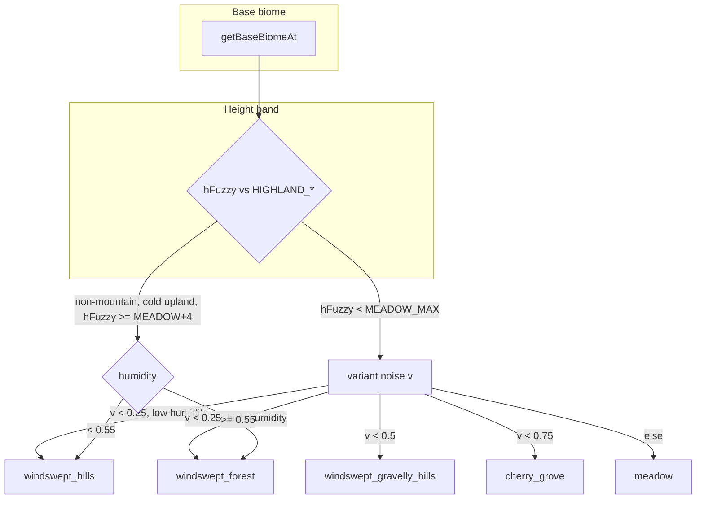

# Windswept Hills (Minecraft) — Technical Breakdown

This document is a **technical, implementation-oriented** explanation of how the **Minecraft Windswept Hills biome** is produced in modern world generation. It serves as the **source of truth** for developing and tuning this biome in Voxely.

Related docs:
- [TERRAIN_SPEC.md](TERRAIN_SPEC.md) — Voxely pipeline and design targets
- [BIOME_TRANSITIONS.md](BIOME_TRANSITIONS.md) — How biome boundaries work
- [DESERT_BIOME_TECHNICAL.md](DESERT_BIOME_TECHNICAL.md) — Same structure for another biome

Reference: [Windswept Hills – Minecraft Wiki](https://minecraft.wiki/w/Windswept_Hills)

---

## 1) Mental model: biome as “rules + configuration”

In Minecraft-like worldgen, a biome such as **Windswept Hills** is best understood as a bundle of:

- **Biome selection rules** (where the biome appears — in Minecraft: high erosion, high weirdness, high continentalness)
- **Terrain parameters** (macro shape: shattered, hilly, peaks ~Y 140)
- **Surface rules** (grass/stone top layers; snow above snowfall line)
- **Feature/decoration rules** (sparse oak/spruce, dandelion, poppy, bushes; emerald ore, infested blocks)
- **Variant rules** (Windswept Forest = more humid/wooded; Windswept Gravelly Hills = gravel surface)
- **Spawn + ambience** (llamas, cold farm animals; grass/foliage aqua tint)

Windswept Hills are **cold mountainous** biomes with “shattered” terrain, grass and stone, often bordering swamps and their wooded/gravelly variants.

---

## 2) Stage A — Biome selection (Minecraft)

### 2.1 Multi-noise parameters

In modern Minecraft (1.18+), Windswept Hills generate in areas with:

- **High erosion** — terrain is carved/eroded, not smooth
- **High PV (weirdness)** — peaks/valleys phase favours dramatic relief
- **High continentalness** — inland, mountain-like character

The biome is chosen by matching the sampled 6D climate point (continentalness, erosion, temperature, humidity, weirdness, and sometimes depth/height) to predefined target regions. Windswept Hills sit in a region of high erosion, high weirdness, and high continentalness, often near swamps.

### 2.2 Variants and neighbours

- **Windswept Forest** — higher humidity; more trees.
- **Windswept Gravelly Hills** — different surface (gravel/stone mix).
- Boundaries to **Swamp**, **Meadow**, **Grove**, and peak biomes (e.g. Snowy Slopes, Frozen Peaks) are determined by the same multi-noise logic and height.

---

## 3) Stage A — Voxely mapping (current implementation)

In Voxely, **Windswept Hills is not a base biome**. It is **resolved** from either **mountain** or a cold upland base via `getResolvedBiomeFromHeight()` in [src/terrain/index.ts](../src/terrain/index.ts).

### 3.1 When base is mountain

For `base === 'mountain'`, resolved biome depends on **height** (with a small transition offset) and **variant noise**.

**Height band: `hFuzzy < HIGHLAND_MEADOW_MAX`** (i.e. below meadow band):

- `v = (highlandVariantNoise2D(...) + 1) * 0.5` (in [0, 1])
- If `v < 0.25`: **windswept_forest** if `humidity >= WINDSWEPT_FOREST_HUMIDITY_MIN`, else **windswept_hills**
- If `v < 0.5`: **windswept_gravelly_hills**
- If `v < 0.75`: **cherry_grove**
- Else: **meadow**

So Windswept Hills appear in the **lowest highland band** (below meadow), when variant noise is in the first quarter and humidity is below the forest threshold.

**Height band: `HIGHLAND_MEADOW_MAX <= hFuzzy < HIGHLAND_GROVE_MAX`**:

- Mostly **grove**; **windswept_forest** only when variant noise `v > 0.82`. No windswept_hills in this band.

**Higher bands** become snowy_slopes, then peak biomes (stony_peaks, frozen_peaks, jagged_peaks) via multi-noise.

### 3.2 When base is not mountain/snow (e.g. plains)

If `base !== 'mountain' && base !== 'snow'`:

- If `temp <= COLD_UPLAND_TEMP_MAX` and `hFuzzy >= HIGHLAND_MEADOW_MAX + 4`:
  - **windswept_forest** if `humidity >= WINDSWEPT_FOREST_HUMIDITY_MIN`, else **windswept_hills**

So Windswept Hills can also appear on **cold upland** terrain (e.g. cold plains at sufficient height) when humidity is low.

### 3.3 Constants (from `src/terrain/index.ts`)

| Constant | Value | Meaning |
|----------|--------|---------|
| `WATER_LEVEL` | 64 | Sea level (from [constants.ts](../src/constants.ts)) |
| `HIGHLAND_MEADOW_MAX` | WATER_LEVEL + 10 (74) | Upper bound of lowest highland band (windswept/meadow/cherry) |
| `HIGHLAND_GROVE_MAX` | WATER_LEVEL + 20 (84) | Upper bound of meadow band, start of grove band |
| `HIGHLAND_SNOWY_SLOPES_MAX` | WATER_LEVEL + 30 (94) | Above this, snowy slopes / peaks |
| `COLD_HIGHLAND_TEMP_MAX` | 0.42 | Cold highland temperature cap |
| `COLD_UPLAND_TEMP_MAX` | 0.5 | Cold upland temperature cap (for non-mountain windswept) |
| `HIGHLAND_VARIANT_SCALE` | 0.004 | Scale for variant noise (x, z) |
| `WINDSWEPT_FOREST_HUMIDITY_MIN` | 0.55 | Humidity above which windswept_forest is chosen over windswept_hills |

### 3.4 Biome resolution flow (Voxely)

---

## 4) Stage B — Terrain shape (Minecraft + Voxely)

### 4.1 Minecraft

- Terrain is **usually flat but sometimes hilly and shattered** (towering mountains, overhangs, floating blocks/islands in some generations).
- Peaks reach roughly **Y ≈ 140**.
- Shape is driven by the same erosion/weirdness/continentalness that select the biome; no separate “Windswept Hills height function” — the biome sits in a band of the global terrain.

### 4.2 Voxely

Terrain shape for Windswept Hills is controlled by **TerrainParams** in [src/terrain/biomes/windswept_hills.ts](../src/terrain/biomes/windswept_hills.ts):

| Param | Value | Effect |
|-------|--------|--------|
| baseOffset | 2 | Base height offset |
| detailAmp | 2.5 | Detail noise amplitude |
| detailFreq | 0.014 | Detail noise frequency |
| flatness | 0.6 | Flattening factor |
| mountainAllowed | true | Can participate in mountain height boost |

**Comparison with variants:**

- **Windswept Forest**: slightly flatter (flatness 0.65), slightly less detail (detailAmp 2.2, detailFreq 0.015).
- **Windswept Gravelly Hills**: similar to Windswept Hills (flatness 0.55, same detailAmp/detailFreq). Difference is mainly surface blocks (gravel) and no flowers/tall_grass.

---

## 5) Stage C — Surface rules

### 5.1 Minecraft

- **Top**: grass block (snow layer above snowfall line).
- **Below**: dirt/stone layers.
- **Shore/water edge**: stone/gravel.
- **Snowfall line**: above **Y ≈ 120 ± 8** precipitation becomes snow; hills become snow-capped, water freezes to ice.

### 5.2 Voxely

Defined in [src/terrain/biomes/windswept_hills.ts](../src/terrain/biomes/windswept_hills.ts) via **BiomeBlockSet** / **LayerConfig**:

- **surface**: grass  
- **subsurface**: stone  
- **subsurfaceDepth**: 3  
- **shore**: gravel  
- **underwater**: gravel  

**Snow:** In Voxely, snow is applied globally by `snowAccumulationHeight` and only to biomes in `SNOW_BIOMES` (snow, snowy_slopes, frozen_peaks, jagged_peaks, grove). **Windswept Hills is not in SNOW_BIOMES**, so there is **no Y-based snowfall** for this biome in the current implementation.

**TARGET (future):** Add an optional Y-based snow layer for Windswept Hills (e.g. above WATER_LEVEL + 56 or a configurable “snow line”) so peaks can be snow-capped without making the whole biome a snow biome.

---

## 6) Stage D — Features (Minecraft vs Voxely)

### 6.1 Minecraft

- **Vegetation:** Oak and spruce trees **occasionally**; grass, poppy, dandelion, bushes (1.21.5+).
- **Underground:** **Emerald ore** only in this biome and mountain biomes; **infested blocks** (silverfish) below sea level.

### 6.2 Voxely — flowers

In [src/terrain/features/flowers.ts](../src/terrain/features/flowers.ts), **windswept_hills** has:

| Block | minThreshold | maxThreshold |
|-------|--------------|--------------|
| dandelion | 0.18 | 0.52 |
| tulip_red | 0.52 | 0.65 |

Poppy is not in the current windswept_hills flower list; Minecraft has poppy and dandelion — adding poppy is a possible TARGET.

### 6.3 Voxely — ground (tall grass, ferns)

- **Ground** ([src/terrain/features/ground.ts](../src/terrain/features/ground.ts)): windswept_hills uses **tall_grass** with `minThreshold: 0.35`, `maxThreshold: 0.8`.
- **Ferns** ([src/terrain/features/ferns.ts](../src/terrain/features/ferns.ts)): windswept_hills is enabled (ferns can place on grass/dirt).

### 6.4 Voxely — trees

In [src/terrain/index.ts](../src/terrain/index.ts), `shouldPlaceTree()` **explicitly excludes** windswept_hills and windswept_gravelly_hills: **no trees** are placed in these biomes. Minecraft has occasional oak and spruce.

**TARGET (design choice):** Either keep “no trees” for a more barren look, or add **sparse** tree placement (e.g. high placement threshold) for windswept_hills to align with Minecraft.

### 6.5 Not implemented in Voxely (reference only)

- **Emerald ore** (biome- and height-specific)
- **Infested blocks** (silverfish)
- **Bushes** (1.21.5+ block) — no bush feature in Voxely yet

---

## 7) Variants (Windswept Forest, Windswept Gravelly Hills)

### 7.1 Windswept Forest

- **Minecraft:** More humid; more trees.
- **Voxely:** Selected when humidity ≥ `WINDSWEPT_FOREST_HUMIDITY_MIN` (0.55) in the same height/variant band; **trees are placed** (forest density + placement threshold). Same surface as Windswept Hills (grass, stone, gravel shore).

### 7.2 Windswept Gravelly Hills

- **Minecraft:** Surface includes gravel and stone patches.
- **Voxely:** [src/terrain/biomes/windswept_gravelly_hills.ts](../src/terrain/biomes/windswept_gravelly_hills.ts) — **surface**: gravel; **subsurface**: stone; **shore**: sand; **underwater**: sand. **No flowers**, **no tall_grass**, **no trees**.

---

## 8) Snow line and ambience

### 8.1 Minecraft

- **Snowfall:** Above **Y ≈ 120 ± 8** precipitation becomes snow; grass can be covered by snow layers; water freezes.
- **Grass/foliage tint:** **Aqua** (dull green-blue), distinct from plains/forest.

### 8.2 Voxely

- **Snow:** No Y-based snow for windswept_hills (see §5.2). TARGET: optional snow above a configurable Y.
- **Tint:** No dedicated grass/foliage colour for windswept_hills. TARGET: aqua tint if/when biome-based tinting is added.

---

## 9) Spawns (Minecraft reference)

Minecraft spawns in Windswept Hills include: **llamas**, **cold chicken/pig/cow**, **sheep**, standard monsters (creeper, skeleton, zombie, etc.), and ambient (bat). In Voxely, spawn logic is handled elsewhere; this doc only records the Minecraft behaviour for reference.

---

## 10) Minimal “Windswept Hills” spec (re-implementation checklist)

For another engine or a full re-implementation:

- **Biome selection**
  - High **erosion**, high **weirdness** (PV), high **continentalness** (multi-noise 6D).
  - Variants: Forest (higher humidity, more trees), Gravelly (gravel/stone surface).
- **Terrain**
  - Shattered/hilly; peaks in the Y ~140 range (or engine equivalent). Use same erosion/weirdness/continentalness to drive shape.
- **Surface rules**
  - Top: grass (or gravel for gravelly variant); subsurface: stone; shore: gravel (or sand for gravelly).
  - Optional: snow above Y ≈ 120 ± 8.
- **Features**
  - Sparse oak and spruce; dandelion, poppy, bushes; tall grass, ferns.
  - Optional: emerald ore and infested blocks in this biome only (or shared with mountains).
- **Ambience**
  - Grass/foliage aqua tint; cold animal variants; llama spawns.

---

## 11) Voxely implementation summary

| Aspect | Location | Status |
|--------|----------|--------|
| Biome definition (blocks, terrain params) | [src/terrain/biomes/windswept_hills.ts](../src/terrain/biomes/windswept_hills.ts) | Done |
| Biome selection (resolved from mountain / cold upland) | [src/terrain/index.ts](../src/terrain/index.ts) `getResolvedBiomeFromHeight` | Done |
| Tree placement (excluded for windswept_hills) | [src/terrain/index.ts](../src/terrain/index.ts) `shouldPlaceTree` | Done (no trees) |
| Flowers (dandelion, tulip_red) | [src/terrain/features/flowers.ts](../src/terrain/features/flowers.ts) | Done |
| Tall grass | [src/terrain/features/ground.ts](../src/terrain/features/ground.ts) | Done |
| Ferns | [src/terrain/features/ferns.ts](../src/terrain/features/ferns.ts) | Done |
| Y-based snow for windswept_hills | — | **Missing** (TARGET) |
| Grass/foliage aqua tint | — | **Missing** (TARGET) |
| Sparse oak/spruce | — | **Optional** (design choice) |
| Poppy in flowers | flowers.ts | Optional |
| Bushes | — | **Missing** (block/feature not in game) |
| Emerald ore / infested blocks | — | **Missing** (ore/feature system) |

This document is the single source of truth for “how Windswept Hills work technically” and “where they are implemented in Voxely.”
